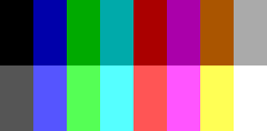

# QBAGLE v1.0

QBAGLE es un sistema sencillo para crear aventuras gráficas de pantalla fija (o en primera persona) para MSDOS usando el modo EGA. Está basada en QBasic, por lo que necesita este intérprete para funcionar (incluido en `/bin/`).

QBAGLE es en realidad un intérprete de aventuras que se definen en base a un script y una serie de recursos (gráficos, músicas y sonidos). Las aventuras se basan en colocar una imagen y definir una serie de zonas activas en la pantalla sobre las que el usuario podrá hacer click. Las zonas pueden definirse como salidas, de forma que al hacer click sobre ellas se salte a otro punto del script (a otra localización por ejemplo) o como objetos o zonas de interés, que harán aparecer un sencillo menú con dos opciones: "MIRAR" o "ACCION". También se define un sencillo inventario que podemos ir poblando con objetos y que podrán ser utilizados con las zonas definidas.

# Ejecutando QBAGLE

Para ejecutar QBAGLE necesitas un PC con MSDOS o un emulador como DosBox o PcEm. Tendrás que tener `QBASIC.EXE`, `QBASIC.HLP` y `QBASIC.INI` accesibles (o bien mediante la variable `PATH` o bien en el mismo directorio que el juego).

El intérprete principal, `QB1AGLE.BAS`, cargará por defecto un archivo `SAMPLE.SPT` colocado en el mismo directorio. Si el script principal de tu aventura tiene otro nombre, deberás modificar la linea 253:

```bas
    res% = QAGLrunScript%("SAMPLE.SPT", "", "", 0)
```

## El ejemplo

La forma más fácil de que veas esto en acción es ejecutando el ejemplo mediante DosBox. Suponemos que tienes una idea básica de cómo funciona DosBox, así que partiremos de que tienes montado el directorio base de QBAGLE como unidad `D:` (por ejemplo). Para comprobarlo, al hacer `dir` deberíamos obtener este listado:


Hecho esto, entramos en `EXAMPLES\SIMPLE`:

```
D:\>cd EXAMPLES\SIMPLE
```

Desde aquí, ejecutamos el intérprete `QB1AGLE.BAS` invocando al `QBASIC.EXE` que está en `/bin`:

```
D:\EXAMPLES\SIMPLE>..\..\bin\QBASIC /run QB1AGLE.BAS
```

En el ejemplo podemos ver más o menos qué tipo de juegos podremos hacer con este sistema.

# Haciendo tu propio juego

Hacer un juego se basa en tener tus recursos, convertirlos al formato soportado por el motor (formato `PUT`, compatible con el comando del mismo nombre de QBasic), y escribir un script en un lenguaje sencillo. Hay tres tipos de recursos:

## Imagenes

Las imagenes están en un formato que QBasic pueda leer y procesar fácilmente. Hay dos tipos:

* Imágenes sólidas: se vuelcan a la pantalla tal cual.
* Imágenes transparentes: se vuelcan a la pantalla con transparencia, dejando ver lo que había antes en aquellos píxels de color "transparente".

El conversor incluido, `QB1AGLEimgcnv.exe`, procesará imagenes que empléen la paleta EGA estándar:



Cualquier píxel de otro color será considerado como "transparente".

`QB1AGLEimgcnv.exe` tomará los siguientes parámetros:

```
    $ QB1AGLEimgcnv.exe in=file.png out=file.put [mode=trans] [cutout=x0,y0,x1,y1]

    in        Input filename
    out       Output filaname
    mode      solid or trans, solid is default.
    cutout    output rectangle (coordinates inclusive) instead of full image
```

Donde: 

* `in` es el nombre (con ruta opcional) de archivo de entrada, en formato `png`.
* `out` es el nombre (con ruta opcional) de archivo de salida, en formato `PUT`.
* `mode` indica si la salida será transparente o sólida. Si no se especifica este parámetro, será sólida.
* `cutout` define las coordeandas de las esquinas opuestas del rectángulo que se va a procesar. Si se omite, se procesará toda la imagen.

Restricciones y gotchas:

* Las imagenes transparentes ocupan el doble que las sólidas, pues almacenan la máscara. No emplées imagenes transparentes si no es necesario.
* Las imagenes deben tener un ancho múltiplo de 8 píxels.
* Si se especifica `cutout`, `x0, y0` debe ser las coordenadas del píxel superior izquierdo del rectángulo que se va a recortar y `x1, y1` las del inferior derecho.

## Música

La música se reproduce usando un conjunto de subrutinas creadas por Bisqwit ( https://bisqwit.iki.fi/source/fmengineqb.html ) que reproducen archivos S3M de Scream Tracker 3 que empléen sonidos FM (no samples). Actualmente no conozco otra forma de crearlos que no sea usando el propio Scream Tracker 3, al que te tendrás que acostumbrar y ejecutar en DosBOX (por ejemplo).

## Sonido

El motor es capaz de tocar archivos en formato .VOC de 8 bits sin signo a 8000Hz de hasta 8192 bytes (8Kb). Realmente oldschool. Busca tu conversor favorito para conseguirlos.

# Construyendo el script: conceptos

## El buffer fuera de pantalla.

A la hora de componer la imagen (poner un fondo, colocar sobre él pequeños recortes transparentes con objetos o cosas que deban cambiar dependiendo del estado del juego, etc), todo se hace en un buffer que debe copiarse a la pantalla visual (en realidad se hace en una página de VRAM no visible). Para ello usamos el comando `BLIT`.

## Estado del juego: Flags e inventario.

El juego no es una entidad estática. Tenemos herramientas para que la narración vaya en diferentes direcciones, y para ello tenemos dos herramientas para representar el "estado" del juego en todo momento:

### Flags

En el motor disponemos de 256 flags donde podemos almacenar valores enteros (números de -32768 a 32767). Los flags se nombran con el símbolo `$` seguido del número de flag. Por ejemplo, este comando:

```
    $10 = 1
```

Dará al flag 10 el valor 1. Inicialmente todos los flags valen 0, pero es buena práctica inicializarlos de todos modos. Los flags pueden usarse en condicionales e instrucciones de GOTO compuesto, como veremos en este manual.

### Inventario

Como hemos dicho nuestro inventario puede contener hasta 10 items. El inventario se maneja con una serie de comandos y se comprueba con una serie de condiciones que nos permiten limpiar el inventario, aadir o quitar objetos, o comprobar si tenemos un objeto en concreto.

## Etiquetas

Las etiquetas marcan un punto en el script. Deben ir al principio de la linea y empezar por dos puntos :. Servirán de destino para las instrucciones de salto.

## Comentarios

Todo el texto que aparezca a la derecha del símbolo # será ignorado por el intérprete.

# Manual de programación

## Imprimir texto

Para imprimir textos (descripciones, diálogos) primero hay que abrir una ventana de texto, y luego imprimir en ella. Cuando terminemos, podremos por ejemplo esperar a pulsar una tecla y luego cerrar la ventana de texto:

```
    OPENBOX RIGHT
    PRINT "Seguramente ya me conoces y sabes que me gusta el bocadillo de ch\opped."
    PRINT "Ay\udame a hacer un par de cosas sencillas, que me tengo que ir a trabajar..."
    WT
    CLOSEBOX    
```

* `OPENBOX RIGHT` abre una ventana de texto a la derecha. Hay tres tipos de ventanas de texto: un cuadro centrado aproximadamente de 1/3 de la altura de la pantalla (`OPENBOX CENTER`), uno pegado a la parte inferior de la pantalla e igualmente de aproximadamente 1/3 de la pantalla de altura (`OPENBOX BOTTOM`) y otro que ocupa toda la mitad derecha de la pantalla (`OPENBOX RIGHT`).

* `PRINT` imprime un párrafo con el texto que se le indica, dentro del cuadro que acabamos de abrir. Puedes añadir los párrafos que quieras (siempre que quepan).

* `WT` interrumpe la ejecución hasta que pulsemos una tecla o hagamos click.

* `CLOSEBOX` cierra la ventana y la elimina de pantalla, mostrando de nuevo el fondo que hubiera detrás.

Como construcciones como la de arriba son muy comunes, hemos añadido una abreviatura que junta todos esos comandos en uno:

```
    TEXTWT RIGHT, "Seguramente ya me conoces y sabes que me gusta el bocadillo de ch\opped.", "Ay\udame a hacer un par de cosas sencillas, que me tengo que ir a trabajar..."
```

El primer parámetro puede ser `RIGHT`, `CENTER` o `BOTTOM` y equivale al que se pasaba a `OPENBOX`. Luego, separados por comas y entre comillas, va la lista de párrafos. El comportamiento, como hemos dicho, es el mismo de antes: abre una caja de texto en el lugar especificado, imprime en ella, espera a que pulsemos una tecla o hagamos click, y finalmente "cierra" la caja de texto (eliminándola de la pantalla y restaurando el fondo).

Cuando hacemos `WT` (ya sea de forma explícita o como parte de `TEXTWT`), las coordenadas (x, y) del ratón donde el usuario ha pulsado se almacenan en los flags 253 y 254, respectivamente.

## Mostrar imagenes

Hay dos formas de mostrar imagenes, sin importar que estas sean transparentes o sólidas:

* `SCREEN file` carga `file` del disco (puede incluir una ruta relativa o absoluta) y la dibuja en (0, 0). Suele utilizarse para cargar imagenes que ocupen toda la pantalla.

* `PUT x, y, file` carga `file` del disco (puede incluir una ruta relativa o absoluta) y la dibuja en (x, y).

Como se ha mencionado anteriormente, las imagenes no se mostrarán inmediatamente, sino que se irán dibujando en un buffer. Para hacerlo todo visible hay que ejecutar el comando `BLIT`, que copiará el buffer a la pantalla.

Además, tenemos `CLS` que borrará el buffer.

## Saltos

### Saltos incondicionales

Para saltar incondicionalmente a una etiqueta, usaremos `GOTO :etiqueta`. 

Para volver a `<action_prefix>_MAINLOOP` usaremos `RETURN` (ver `ACTION` más adelante).

### Saltos condicionales

* `GOTOF :etiqueta, flag` saltará a una etiqueta `:etiqueta_N` donde `N` es el valor de `flag`.

* `EQ v1, v2, :etiqueta` saltará a `:etiqueta` si `v1` y `v2` son *iguales*. Nótese que tanto `v1` como `v2` pueden ser un flag (si empiezan con `$`).

* `NEQ v1, v2, :etiqueta`, análogo, pero saltando si `v1` y `v2` son *distintos*.

* `LT v1, v2, :etiqueta`, análogo, pero saltando si `v1` < `v2`.

* `GE v1, v2, :etiqueta`, análogo, pero saltando si `v1` >= `v2`.

## Encadenando

* `RUN script, :etiqueta` ejecutará el script `script` (puede incluir una ruta relativa o absoluta) a partir de la etiqueta `:etiquieta`. Si `:etiqueta` se omite o vale `INI` se ejecutará desde el principio.

## Acabando

* `THE_END` termina la ejecución del juego.

## Tres opciones

* `ANSWER texto1, texto2, texto3` mostrará una caja de texto con las tres cadenas, dejando que el jugador elija una. Tras esto, el motor almacenará qué respuesta se pulsó (1, 2 o 3) en el flag 251.

## Zonas

Las zonas son rectángulos de la pantalla que el jugador puede pulsar para saltar a otra localización o interactuar con lo que haya dibujado ahí.

* `RESETZONES` elimina todas las zonas definidas.

* `ZONE nombre, x1, y1, x2, y2, [EXIT]` define una zona llamada `nombre` como un rectángulo que va desde `(x1, y1)` (esquina superior izquierda) hasta `(x2, y2)` (esquina superior derecha). `nombre` es importante ya que identificará a esta zona en nuestro script. 

El parámetro `EXIT`, si se incluye, hace que esta zona identifique una "salida". Pronto veremos qué significa esto.

En principio podemos definir 16 zonas en la pantalla, pero si necesitas más sólo hay que modificar levemente `QB1AGLE.BAS` cambiando el valor de `CONST MAXZONES = 16` en la linea 100.

Las zonas se pueden superponer, teniendo en cuenta que las zonas se procesan en orden, por lo que si necesitas incluir una zona más pequeña dentro de una grande deberás crear antes la pequeña.

Para ayudarte a definir las zonas hemos incluid una utilidad, `QB1AGL0mkzones.exe`, que puede cargar un archivo png y te deja dibujar rectángulos con el ratón que luego exporta como texto y que puedes usar directamente en tu script.

Una vez definidas las zonas, podemos ejecutar `DOACTIONS` para que el motor deje al usuario interactuar con las zonas:

`DOACTIONS action_prefix`

Cuando el script llegue a este punto se dejará al usuario interactuar con la escena, haciendo click. Si se hace click sobre una zona y esta está definida como salida, el motor hará un `GOTO` a una etiqueta `<action_prefix>_IR_<zona>`, donde `<zona>` será la zona donde ha pulsado el usuario.

Si la zona no está definida como salida, el motor presentará un menú de dos opciones (es muy fácil cambiar el motor para añadir más opciones, por cierto; ver más adelante): `MIRAR` y `ACCION`. Dependiendo de la que pulse el usuario, el motor hará un `GOTO` a una etiqueta `<action_prefix>_<verb>_<zona>`, donde `<verb>` será el verbo que eligió el usuario y `<zona>` la zona sobre la que pulsó.

Si el usuario pulsa pero no acierta en ninguna zona, `DOACTIONS` no hará nada y el script seguirá su ejecución.

Normalmente, lo que se hace es definir una etiqueta `:<action_prefix>_MAINLOOP` antes de `DOACTIONS action_prefix`, con dos objetivos:

* Colocar un `GOTO :<action_prefix>_MAINLOOP` detrás de `DOACTIONS action_prefix` para que se vuelva a ejecutar la parte en la que se deja al usuario interactuar con la escena.
* Conseguir que `RETURN` vuelva al `DOACTIONS` de la escena.

Para ilustrarlo mejor, consideremos un ejemplo sencillo:

``` 
    :LocEjemplo
        RESETZONES
        ZONE OBJETO, 0, 0, 159, 199
        ZONE SALIDA, 160, 0, 319, 199, EXIT

    :LocEjemplo_MAINLOOP
        DOACTIONS LocEjemplo
        GOTO :LocEjemplo_MAINLOOP

    :LocEjemplo_MIRAR_OBJETO
        TEXTWT BOTTOM, "Mirar objeto"
        RETURN

    :LocEjemplo_ACCION_OBJETO
        TEXTWT BOTTOM, "Accion objeto"
        RETURN

    :LocEjemplo_IR_SALIDA
        TEXTWT BOTTOM, "Salida"

    :OtraLocEjemplo
        # ...
```

Estamos definiendo una localización "LocEjemplo". Primero ejecutamos `RESETZONES` y definimos dos grandes zonas: la mitad izquierda de la pantalla representará a un objeto, y la derecha una salida.

`DOACTIONS LocEjemplo` definirá `<action_prefix>` como `LocEjemplo` y dejará que el usuario interactúe con las zonas. Dependiendo de qué pulse, generará GOTOs a las etiquetas `:LocEjemplo_MIRAR_OBJETO`, `:LocEjemplo_ACCION_OBJETO` o `:LocEjemplo_IR_SALIDA`. Si no se pulsa sobre ninguna zona (en este ejemplo no es posible) seguiría ejecutando el script, encontraría `GOTO :LocEjemplo_MAINLOOP` y volvería atrás.

En cada una de las etiquetas imprimimos un texto y luego ejecutamos `RETURN`, que en realidad es un alias de `GOTO LocEjemplo_MAINLOOP` que resulta bastante más cómodo y legible.

### Modificando zonas

Las zonas definidas se pueden modificar o eliminar:

* `ZONEMODIFY nombre, nuevo_nombre, x1, y1, x2, y2` modificará los valores de la zona `nombre`.

* `ZONEDELETE nombre` elimina la zona `nombre`.

## El inventario

La gestión del inventario tiene dos partes: primero definir los objetos y sus gráficos asociados (para que aparezcan en el inventario que se muestra en la parte superior de la pantalla), y luego los comandos asociados a operar o hacer comprobaciones.

Los gráficos asociados a los objetos son cuadrados de 32x32 pixels que se pintarán en el inventario. Puedes verlos en acción en la aventura de ejemplo cuando acercas el ratón a la parte superior de la pantalla.

Para decirle al motor que nuestro juego necesita inventario y que lo active al llevar el ratón a la parte superior de la pantalla tendremos que ejecutar

* `INVENTORY ON`.

Para eliminar todos los objetos definidos en el juego ejecutaremos

* `CLEARITEMS`.

Lo primero que haremos será definir el gráfico que representa un slot "vacío" del inventario.

* `DEFEMPTY file`, donde `file` es una imagen (puede incluir ruta relativa o absoluta).

Y tras esto definiremos todos los objetos que pueden aparecer en nuestro juego:

* `DEFITEM nombre, file` añade al juego un item identificado por `nombre` y representado por la imagen `file` (que, como siempre, puede incluir rutas absolutas / relativas).

Habiendo definido los objetos del juego y activado el inventario, podemos empezar a operar con él:

* `CLEARINVENTORY` elimina cualquier objeto que pudiera haber en el inventario.

* `GRAB nombre` añade al inventario el objeto definido como `nombre`, siempre que quepa (si no, se mostrará un mensaje al jugador).

* `DROP nombre` elimina el objeto `nombre` del inventario. Si `nombre` no está en el inventario, no pasará nada.

* `HASITEM nombre, :etiqueta` si el objeto `nombre` está en el inventario, saltará a `:etiqueta`. 

## Sonido

Como hemos dicho, el motor soporta sonido digital en formato VOC (8000Hz, 8 bit sin signo, hasta 8Kb) y música en formato S3M con instrumentos FM.

* `SOUND file, [BG]` tocará el sonido contenido en el archivo `file` (que, como siempre, puede contener una ruta). Si se incluye `BG` el sonido se tocará de fondo sin interrumpir la ejecución.

* `MUSIC PLAY file` tocará de fondo la música S3M/FM en el archivo `file` (puede tener ruta bla bla).

* `MUSIC STOP` parará la música de fondo.

# Modificando el motor

Vamos a explicar cómo podemos modificar el motor para presentar más opciones en el menú emergente que aparece cuando el jugador pulsa sobre una zona. Tendremos que editar `QB1AGLE.BAS` y localizar el código de la `SUB` `QAGLaction`.

Aquí, alrededor de la linea 1272, aparece el código que dibuja la caja:

```bas
    Xb% = x% \ 8 + 1 - 3: Yb% = y% \ 8 + 1
    IF Xb% < 1 THEN Xb% = 1
    IF Yb% < 1 THEN Yb% = 1
    IF Xb% > 35 THEN Xb% = 35
    IF Yb% > 23 THEN Yb% = 23
    x0% = (Xb% - 1) * 8 - 4: x1% = x0% + 55
    y0% = (Yb% - 1) * 8 - 4: y1% = y0% + 23
    LINE (x0%, y0%)-(x1%, y1%), 0, BF
    QAGLfancyBoxWire x0%, y0%, x1%, y1%
    
    COLOR 15: LOCATE Yb%, Xb%: PRINT "MIRAR"; : LOCATE Yb% + 1, Xb%: PRINT "ACCION";
```

Primero habrá que hacer sitio a la caja. Ahora mismo se pinta de forma que hay sitio para dos lineas de texto (de 8 pixels de alto cada una) con márgenes de 4 pixels arriba y abajo (24 píxels en total) y seis caracteres (de 8 pixels de ancho cada uno) con márgenes de 4 pixels a izquierda y derecha (56 píxels en total). 

Este grupo de lineas calcula en qué caracter (de la rejilla de 40x25 caracteres de 8x8 del modo EGA) se pintará el TEXTO de la caja (no el borde)

```bas
    Xb% = x% \ 8 + 1 - 3: Yb% = y% \ 8 + 1
    IF Xb% < 1 THEN Xb% = 1
    IF Yb% < 1 THEN Yb% = 1
    IF Xb% > 35 THEN Xb% = 35
    IF Yb% > 23 THEN Yb% = 23
```

Nuestra caja de 7x3 caracteres (56x24 píxels) se pintará más o menos por debajo de donde se pulsó, centrada:

* `Xb%` valdrá `x% \ 8` (pasamos la coordenada en pixels del ratón a caracteres) más 1 (porque las coordenadas de caracteres empiezan en 1) menos 3 (que es 7/2 más o menos). Luego, con lso IFs, nos aseguramos de que la caja no se salga de la pantalla: Xb% se mantendrá entre 1 y 34. Si nuestra palabra más larga en vez de `ACCION` fuera `RECOGER`, que tiene 7 letras, tendríamos que adaptar estos cálculos.
* `Yb%`, de la misma forma, valdrà `y% \ 8` (pasamos la coordenada en pixels del ratón a caracteres) más 1 (porque las coordenadas de caracteres empiezna en 1). Igualmente se limita el rango para no salir de la pantalla.

Las siguientes lineas cogen las coordenadas donde se va a pintar el texto de la caja y calculan la posición en pixels de las esquinas del borde: `(x0%, y0%)` la superior izquierda y `(x1%, y1%)` la inferior derecha:

```bas
    x0% = (Xb% - 1) * 8 - 4: x1% = x0% + 55
    y0% = (Yb% - 1) * 8 - 4: y1% = y0% + 23
```

Luego se dibujan los rectángulos y seguidamente se imprimen las opciones:

```bas
    COLOR 15: LOCATE Yb%, Xb%: PRINT "MIRAR"; : LOCATE Yb% + 1, Xb%: PRINT "ACCION";
```

Imaginemos que queremos añadir dos opciones más: "COGER" y "HABLAR". Como "HABLAR" ocupa lo mismo que "ACCION" sólo tendremos que ajustar la altura del menú. En vez de limitar inferiormente a 23 (para hacer entrar 2 caracteres de alto) limitamos a 21 (para hacer entrar 4).

```bas
    IF Xb% > 35 THEN Xb% = 35
    IF Yb% > 21 THEN Yb% = 21  '' Ahora mide 4 de alto
```

Ahora tendremos que ajustar también los bordes: Ahora en lugar de 4 + 16 + 4 pixels de alto, nuestro recuadro medrá 4 + 32 + 4 (porque las 4 lineas de 8 pixels ocuparán 32 pixels), o sea, 40 pixels. Por tanto, el cálculo del borde cambiará:

```bas
    x0% = (Xb% - 1) * 8 - 4: x1% = x0% + 55
    y0% = (Yb% - 1) * 8 - 4: y1% = y0% + 39  '' Ahora son 40 pixels de alto
```

Finalmente añadiremos nuestras acciones extra:

```bas
    COLOR 15: LOCATE Yb%, Xb%: PRINT "MIRAR"; : LOCATE Yb% + 1, Xb%: PRINT "ACCION";
    LOCATE Yb% + 2, Xb%: PRINT "COGER"; : LOCATE Yb% + 3, Xb%: PRINT "HABLAR";  '' Nuevas opciones
```

Todo esto lo único que hará será mostrar el nuevo menú; ahora tendremos que hacer que las nuevas opciones se reconozcan. Para ello sólo hay que modificar este bloque de código, situado a partir de la linea 1292:

```bas
    ' Check action
    crsr% = 1
    action$ = ""
    IF xm% >= x0% AND xm% <= x1% AND ym% >= y0% AND ym% <= y1% THEN
        IF ym% < y0% + 12 THEN
            action$ = "MIRAR"
        ELSE
            action$ = "ACCION"
        END IF
        lot$ = action$ + " " + zone$
    ELSE
        lot$ = zone$
    END IF
```

En concreto se trata de complicar más esto:

```bas
    IF ym% < y0% + 12 THEN
        action$ = "MIRAR"
    ELSE
        action$ = "ACCION"
    END IF
```

Este código simplemente divide el rectángulo en dos: de mitad hacia arriba es "MIRAR" y de mitad hacia abajo es "ACCION". Podemos modificar este IF fácilmente así: primero vamos intentar obtener un número de 0 a 3 (0, 1, 2, 3) según la altura dentro del recuadro, teniendo en cuenta el margen de 4 pixels. Eliminamos el trozo de cinco lineas de arriba y añadimos:

```bas
    i% = (ym% - y0% - 4) \ 8
    SELECT CASE i
        CASE 0: action$ = "MIRAR"
        CASE 1: action$ = "ACCION"
        CASE 2: action$ = "COGER"
        CASE 3: action$ = "HABLAR"
    END SELECT
```

quedando así:

```bas
    ' Check action
    crsr% = 1
    action$ = ""
    IF xm% >= x0% AND xm% <= x1% AND ym% >= y0% AND ym% <= y1% THEN
        i% = (ym% - y0% - 4) \ 8
        SELECT CASE i
            CASE 0: action$ = "MIRAR"
            CASE 1: action$ = "ACCION"
            CASE 2: action$ = "COGER"
            CASE 3: action$ = "HABLAR"
        END SELECT
        lot$ = action$ + " " + zone$
    ELSE
        lot$ = zone$
    END IF
```

# Fin

¿Hará alguien algo con esto algún día?
